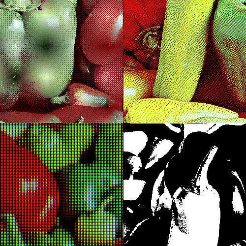

# ditherer

[](https://travis-ci.org/gyng/ditherer)



For all your online dithering needs.

#### TODO

* Cleanup
* Adaptive palette
* More filters
* Better UI/UX

#### Deploying

```
NODE_ENV=production yarn build
git checkout gh-pages
rm commons.js index.html app.*.js
mv build/* .
git add .
git commit
git push origin gh-pages
```

#### References

1. http://www.efg2.com/Lab/Library/ImageProcessing/DHALF.TXT
2. http://www.tannerhelland.com/4660/dithering-eleven-algorithms-source-code/
