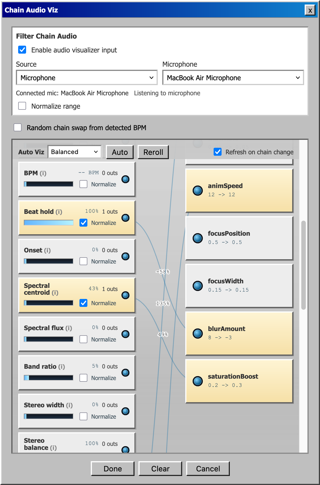
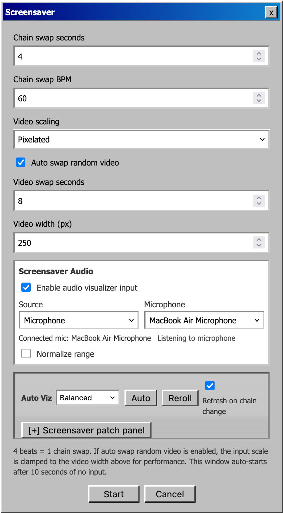

# ditherer

Browser-based image and video creation for dithering, palette reduction, glitch art, print simulation, temporal effects, and filter-chain experimentation.

Audio-reactive too: drive visuals with live microphone or tab audio through per-filter, chain-wide, and screensaver patch panels.

Also useful for lightweight VJing and live visuals too: swap sources, keep output framing stable, and drive filters from live audio.

[Live Site](https://gyng.github.io/ditherer/) · [Gallery](docs/gallery/GALLERY.md)

| | |
|---|---|
|  |  |
|  |  |

## What it does

- Build filter chains in the browser and reorder them with drag and drop
- Process still images or video clips with realtime preview
- Route live audio metrics into filter parameters with per-filter, chain-wide, or screensaver patch panels
- Share looks through URL state or exported JSON
- Export processed output as images, GIFs, or video
- Explore a large built-in library of filters, palettes, and curated presets

## Highlights

- **200+ registered filter entries** spanning dithering, color, stylize, distort, glitch, blur, temporal, simulation, and analysis workflows
- **129 curated chain presets** for looks like VHS pause, cyberpunk, lo-fi webcam, CRT, print, anime, and glitch-art variants
- **Temporal pipeline** with previous-frame input/output buffers, EMA history, and frame index injection for motion- and persistence-based effects
- **Worker offload** for non-temporal chains so the UI stays responsive
- **Gamma-correct pipeline** with optional linear-light processing
- **Palette tooling** including built-in retro/art palettes plus adaptive and extracted palettes
- **Audio-reactive modulation** with microphone or tab audio input, auto-generated mappings, and draggable patch panels
- **WASM acceleration** for performance-critical color distance work with JS fallback
- **Rich export flows** for PNG, JPEG, WebP, GIF, frame sequences, WebM, and browser-dependent MP4 recording paths
- **Static gallery generation** from the live filter/preset registries

## Audio Viz

Ditherer can drive filter parameters from live audio analysis. You can patch metrics like level, bass, beat, spectral flux, or tempo phase into numeric filter controls either per filter, across the whole chain, or in screensaver mode.

<p>
  
</p>
<p>
  
</p>

- Use microphone or tab/system audio as the source
- Auto-generate musical mappings with `Auto Viz` and `Reroll`
- Reuse modulation at the chain level or target a single filter for more surgical control
- Let screensaver mode auto-refresh its routing as the active chain changes

## Examples

Representative animated previews from the generated gallery:

- [Video Feedback](docs/gallery/filters/animated/filter-video-feedback.gif)
- [Floyd-Steinberg](docs/gallery/filters/animated/filter-floyd-steinberg.gif)
- [Cyberpunk preset](docs/gallery/presets/animated/preset-cyberpunk.gif)
- [Traffic Trails preset](docs/gallery/presets/animated/preset-traffic-trails.gif)

## Gallery

- Browse the generated gallery in [docs/gallery/GALLERY.md](docs/gallery/GALLERY.md)
- Regenerate gallery previews with `npm run gallery`

## Development

```bash
npm install
npm run dev
npm run build
npm run preview
npm run lint
npm run typecheck
npm run test
```

Extra repo utilities:

- `npm run bench` to run performance benches
- `npm run bench:compare` to compare benchmark runs
- `npm run report:presets` to find duplicate or highly similar presets
- `npm run gallery` to regenerate `docs/gallery/GALLERY.md` and preview assets

## Build output and deployment

`npm run build` writes a static build to `build/`. The app uses `base: "./"` in Vite, so the output can be hosted from a subdirectory or copied to a static host without extra routing setup.

## Architecture and contributing

- [AGENTS.md](AGENTS.md) covers architecture, filter registration, the temporal pipeline, and contribution expectations
- [`src/filters/index.ts`](src/filters/index.ts) is the registry for filter metadata and worker-visible entries
- [`src/context/FilterContext.tsx`](src/context/FilterContext.tsx) owns chain execution, temporal state, sharing, and worker orchestration
- [docs/plan/](docs/plan/) contains numbered implementation plans
