# Filter Gallery

> All filters applied to `pepper.png` with default settings.

## Dithering

| | | |
|---|---|---|
| **Atkinson (Mac)** Classic Mac dithering with 75% error diffusion for a crisp, high-contrast look 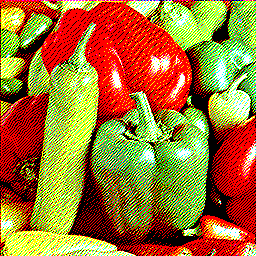 | **Atkinson (Macintosh II color test)** Atkinson dithering with the original Macintosh II 16-color palette 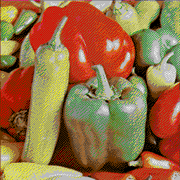 | **Binarize** Simple threshold to pure black and white with no error diffusion  |
| **Burkes** Fast two-row error diffusion with smooth gradients  | **False Floyd-Steinberg** Simplified Floyd-Steinberg using only two neighbors for a grainier result  | **Floyd-Steinberg** The classic error-diffusion algorithm — balanced quality and speed 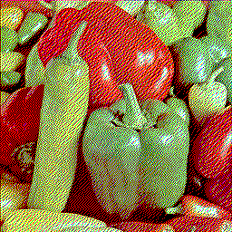 |
| **Floyd-Steinberg (CGA test)** Floyd-Steinberg with the 16-color CGA palette 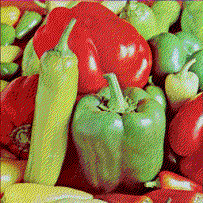 | **Floyd-Steinberg (Vaporwave test)** Floyd-Steinberg with a pastel vaporwave palette 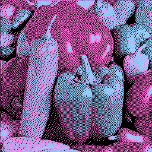 | **Jarvis** Three-row error diffusion for smoother gradients at the cost of speed 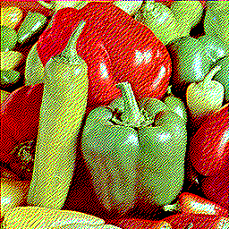 |
| **Ordered** Bayer matrix threshold dithering — fast, tiled, no error diffusion 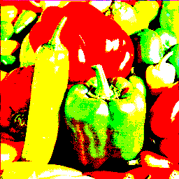 | **Ordered (Gameboy)** Ordered dithering with the 4-shade Gameboy green palette 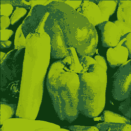 | **Ordered (Downwell Gameboy)** Ordered dithering with Downwell's muted green Gameboy-style palette 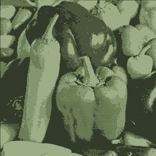 |
| **Ordered (Windows 16-color)** 4x4 Bayer ordered dithering with the classic Windows 16-color palette 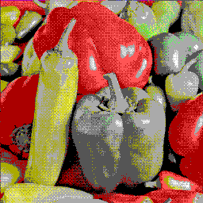 | **Quantize (No dithering)** Reduce colors by snapping each pixel to the nearest palette color 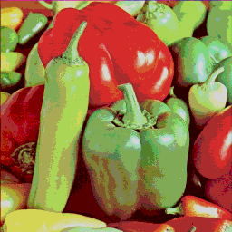 | **Random** Add random noise before quantizing for a stippled, noisy texture 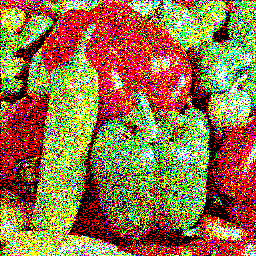 |
| **Sierra (full)** Three-row error diffusion similar to Jarvis but with different weights  | **Sierra (lite)** Minimal Sierra variant — fast with only two neighbors 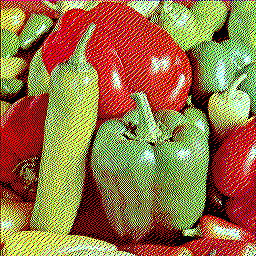 | **Sierra (two-row)** Two-row Sierra for a balance between speed and quality  |
| **Stucki** Three-row error diffusion with sharper results than Jarvis  | **Triangle dither** Triangle-distributed noise dithering for film-like grain 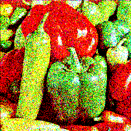 |  |

## Color

| | | |
|---|---|---|
| **Brightness/Contrast** Adjust image brightness and contrast levels  | **Color balance** Shift the balance between complementary color channels  | **Color shift** Rotate hue and shift saturation/lightness  |
| **Duotone** Map shadows and highlights to two custom colors  | **Grayscale** Convert to grayscale using perceptual luminance weights 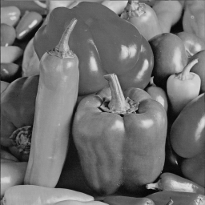 | **Histogram equalization** Redistribute tonal range for better contrast across the image  |
| **Histogram equalization (per-channel)** Equalize each RGB channel independently — can introduce color shifts 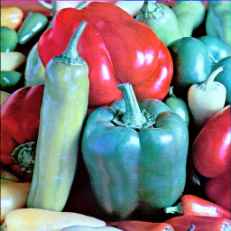 | **Invert** Flip all colors to their complement (negative) 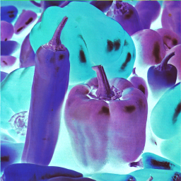 | **Posterize** Reduce color levels per channel for a flat, poster-like look  |
| **Solarize** Partially invert tones above a threshold for a surreal darkroom effect 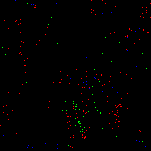 |  |  |

## Stylize

| | | |
|---|---|---|
| **ASCII** Render the image as ASCII characters based on brightness  | **Halftone** Simulate print halftone with variable-size dots 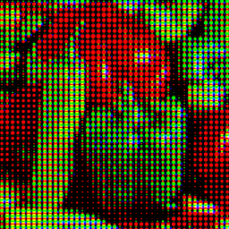 | **K-means** Cluster pixels into k dominant colors using iterative refinement 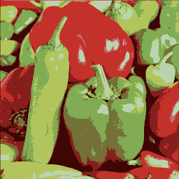 |
| **Kuwahara** Edge-preserving smoothing for a painterly, watercolor-like look  | **Mavica FD7** Emulate the Sony Mavica FD7 — low-res JPEG on a floppy disk 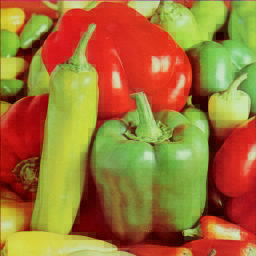 | **Pixelate** Downscale into chunky pixel blocks  |
| **Stripe (horizontal)** Overlay horizontal stripe pattern over the image 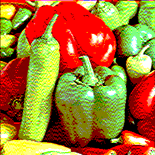 | **Stripe (vertical)** Overlay vertical stripe pattern over the image 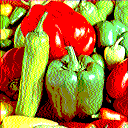 | **Voronoi** Divide the image into irregular cell regions with averaged colors 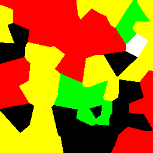 |

## Distort

| | | |
|---|---|---|
| **Chromatic aberration** Offset color channels to simulate lens fringing  | **Chromatic aberration (per-channel)** Move each RGB channel independently for extreme color splitting  | **Displace** Warp pixels using the image's own luminance as a displacement map 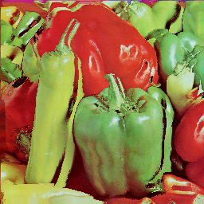 |
| **Displace (smooth)** Displacement mapping with a blurred source for gentler warping  | **Lens distortion** Apply barrel distortion like a wide-angle lens 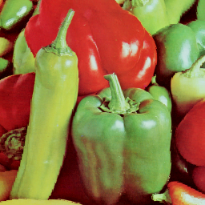 | **Lens distortion (pincushion)** Apply inward pincushion distortion like a telephoto lens  |
| **Wave** Displace pixels along sine waves for a ripple effect  |  |  |

## Glitch

| | | |
|---|---|---|
| **Bit crush** Reduce bit depth per channel for harsh color banding  | **Channel separation** Split and offset RGB channels for a glitchy color-fringe look  | **Jitter** Randomly shift pixel rows for a shaky, unstable signal look 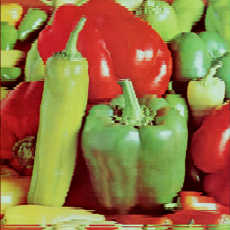 |
| **Pixelsort** Sort pixel spans by brightness for dramatic streak effects  |  |  |

## Simulate

| | | |
|---|---|---|
| **Anisotropic diffusion** Smooth flat regions while preserving edges — like Perona-Malik filtering  | **CRT emulation** Simulate a CRT monitor with phosphor mask, bloom, scanlines, curvature, and vignette 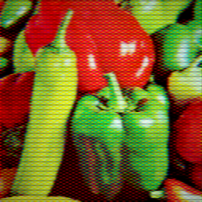 | **Scanline** Add horizontal scanline gaps like a retro CRT display  |
| **VHS emulation** Simulate VHS tape artifacts — color bleed, noise, and tracking errors 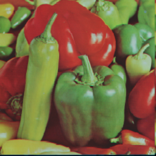 |  |  |

## Blur & Edges

| | | |
|---|---|---|
| **Bloom** Add a soft glow around bright areas  | **Convolve** Apply a custom convolution kernel — blur, sharpen, emboss, and more  | **Convolve (edge detection)** Detect edges using a Laplacian convolution kernel  |
