# Filter Gallery

> Generated from `filterList` and `CHAIN_PRESETS` (browser-registry source of truth).

> Static previews use `pepper.png`. Animated/temporal previews use a 3s sample from `akiyo.mp4` at 10 FPS.

> Static simulation frames per item: 8.

> Filter previews: 238/238 available · Preset previews: 123/123 available.

## Filters

## None

| | | |
|---|---|---|
| **None** Pass-through — leaves the image unchanged. The default chain entry after Clear.  |  |  |

## Dithering

| | | |
|---|---|---|
| **Atkinson (Mac)** Classic Mac dithering with 75% error diffusion for a crisp, high-contrast look 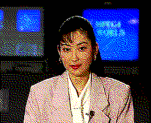 | **Atkinson (Macintosh II color test)** Atkinson dithering with the original Macintosh II 16-color palette 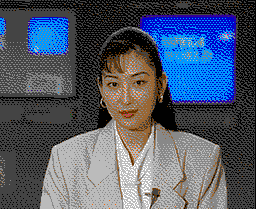 | **Atkinson (Mondrian)** Atkinson dithering with Mondrian's 5-color De Stijl palette 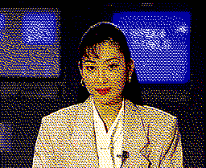 |
| **Binarize** Simple threshold to pure black and white with no error diffusion  | **Burkes** Fast two-row error diffusion with smooth gradients 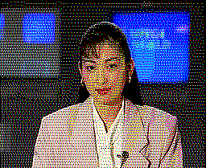 | **Dither gradient** Generate a smooth gradient and dither it — test pattern or standalone gradient art 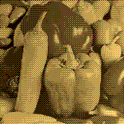 |
| **False Floyd-Steinberg** Simplified Floyd-Steinberg using only two neighbors for a grainier result 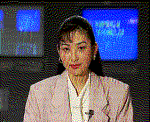 | **Floyd-Steinberg** The classic error-diffusion algorithm — balanced quality and speed  | **Floyd-Steinberg (CGA test)** Floyd-Steinberg with the 16-color CGA palette 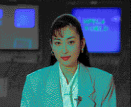 |
| **Floyd-Steinberg (Synthwave)** Floyd-Steinberg with a neon synthwave/outrun palette 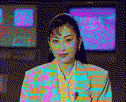 | **Floyd-Steinberg (Vaporwave test)** Floyd-Steinberg with a pastel vaporwave palette 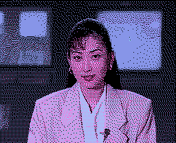 | **Jarvis** Three-row error diffusion for smoother gradients at the cost of speed  |
| **Ordered** Bayer matrix threshold dithering — fast, tiled, no error diffusion 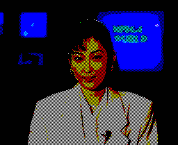 | **Ordered (Amber CRT)** Ordered dithering with 4-shade amber phosphor CRT tones  | **Ordered (Fallwell Greenboy)** Ordered dithering with a muted green Gameboy-style palette 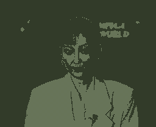 |
| **Ordered (Gameboy)** Ordered dithering with the 4-shade Gameboy green palette 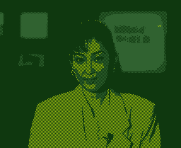 | **Ordered (PICO-8)** Ordered dithering with the PICO-8 fantasy console 16-color palette 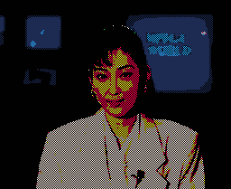 | **Ordered (Windows 16-color)** 4x4 Bayer ordered dithering with the classic Windows 16-color palette 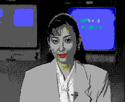 |
| **Posterize dither** Per-channel Bayer ordered dithering with configurable levels per channel 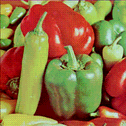 | **Median Cut** Build an adaptive palette with median-cut partitioning and remap the image to it 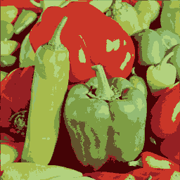 | **Octree Quantize** Adaptive palette reduction using octree subdivision for a different quantization bias 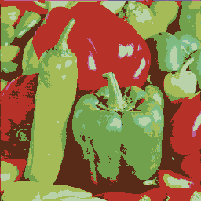 |
| **Quantize (No dithering)** Reduce colors by snapping each pixel to the nearest palette color  | **Random** Add random noise before quantizing for a stippled, noisy texture 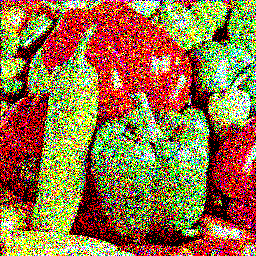 | **Sierra (full)** Three-row error diffusion similar to Jarvis but with different weights  |
| **Sierra (lite)** Minimal Sierra variant — fast with only two neighbors  | **Sierra (two-row)** Two-row Sierra for a balance between speed and quality  | **Stucki** Three-row error diffusion with sharper results than Jarvis 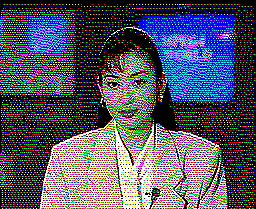 |
| **Threshold map** Dither with custom threshold patterns — Bayer, halftone dot, diagonal, cross, diamond  | **Triangle dither** Triangle-distributed noise dithering for film-like grain 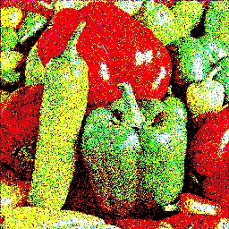 |  |

## Color

| | | |
|---|---|---|
| **Blend** Blend with a color using standard modes — multiply, screen, overlay, and more  | **Brightness/Contrast** Adjust image brightness and contrast levels  | **Channel mixer** Arbitrary RGB matrix multiplication — swap, mix, or invert channels  |
| **Chromatic posterize** Posterize each RGB channel independently with different level counts  | **CLAHE** Contrast Limited Adaptive Histogram Equalization — local contrast enhancement 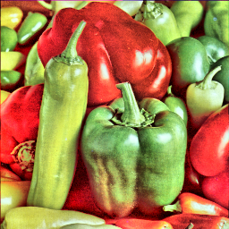 | **Anime Color Grade** Anime-background style grading — cooler cyan shadows, warmer highlights, and controlled vibrance 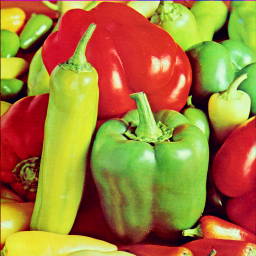 |
| **Anime Ink Lines** Turn image edges into anime-style ink lines, either overlaid on the source or on a flat background 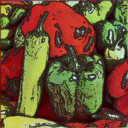 | **Anime Sky** Simplify likely sky regions into a painted anime-style gradient or clouded sky 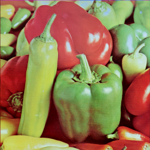 | **Anime Tone Bands** Broad anime-style light and shadow bands with softer tonal transitions 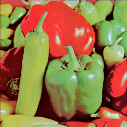 |
| **Atmospheric Haze** Painted atmospheric depth haze with horizon lift and sky-tinted bloom 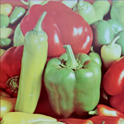 | **Color balance** Shift the balance between complementary color channels  | **Color Pop** Preserve one hue family while muting the rest toward monochrome 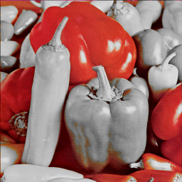 |
| **Color halftone (RGB)** Split RGB channels into separate halftone dots with registration offset  | **Color shift** Rotate hue and shift saturation/lightness  | **Color threshold** Isolate pixels by hue range — keep selected colors, desaturate the rest  |
| **Contour map** Topographic-style elevation bands with distinct colors per luminance level  | **Curves** Remap tonal response with editable control points for RGB or single-channel shaping  | **Dodge / Burn** Classic darkroom technique — dodge lightens shadows, burn darkens highlights 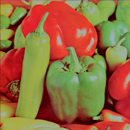 |
| **Duplex / Offset Print** Two-ink print simulation with paper stock showing through the tonal ramp  | **Duotone** Map shadows and highlights to two custom colors  | **Echo Combiner** Amplify movement against the recent average while keeping or removing the static baseline  |
| **Gradient map** Map luminance to a three-stop color gradient for creative toning 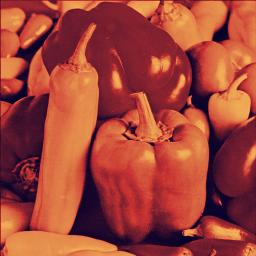 | **Grain merge** High-pass texture enhancement — amplifies existing texture without adding noise  | **Grayscale** Convert to grayscale using perceptual luminance weights  |
| **Foliage Simplifier** Collapse leafy or grassy texture into larger painted masses while keeping silhouettes 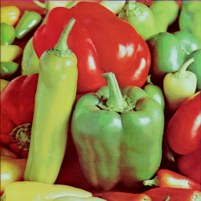 | **Histogram equalization** Redistribute tonal range for better contrast across the image 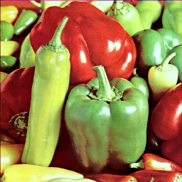 | **Histogram equalization (per-channel)** Equalize each RGB channel independently — can introduce color shifts  |
| **Invert** Flip all colors to their complement (negative)  | **Levels** Adjust black point, white point, and gamma for precise tonal control  | **Luma Matte** Build a cutout matte from luminance and optionally output transparency  |
| **Palette Mapper by Hue Bands** Map hue families into fixed palette slots while preserving tonal structure  | **Posterize** Reduce color levels per channel for a flat, poster-like look 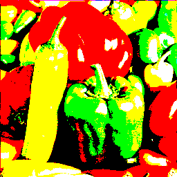 | **Sepia** Warm monochrome toning with adjustable intensity 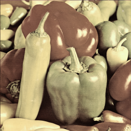 |
| **Solarize** Partially invert tones above a threshold for a surreal darkroom effect  | **Vignette** Darken image edges with adjustable radius, softness, and shape 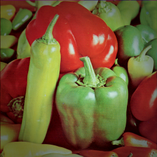 | **Scene Separation** Separate moving and static regions to isolate foreground, reconstruct the background, or freeze still parts of the scene  |
| **Color Cycle** Hue rotates over time — moving areas cycle faster into rainbow trails  | **Poster Hold** Posterized tone bands update with hysteresis so broad regions hold before snapping to new values 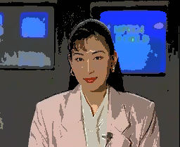 |  |

## Stylize

| | | |
|---|---|---|
| **ASCII** Render the image as ASCII characters based on brightness  | **CMYK halftone** Proper CMYK separation with independent screen angles per channel  | **Contour lines** Topographic contour lines from luminance — lines only, filled bands, or both 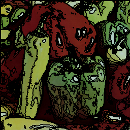 |
| **Cross-stitch** Render the image as stitched X patterns on fabric for an embroidery look 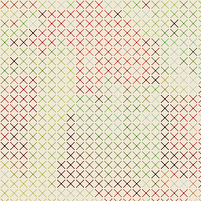 | **Crosshatch** Simulate pen-and-ink crosshatching with luminance-driven line density 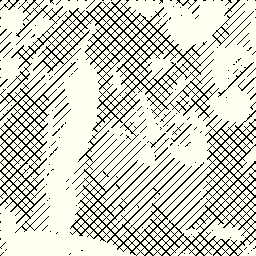 | **Delaunay triangulation** Low-poly triangle mesh with edge-weighted point placement  |
| **Dot matrix** Fixed-pitch dot grid simulating a dot matrix printer with ink and paper colors 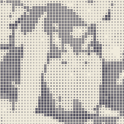 | **Edge trace** Canny-like edge tracing with non-maximum suppression and configurable line color 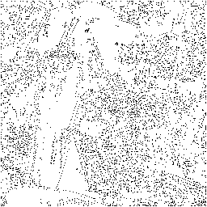 | **Engraving** Parallel lines whose thickness varies with luminance — currency/illustration style  |
| **Flip-Dot Display** Electromechanical dot-sign board with bi-stable cells, hysteresis, and limited flip throughput 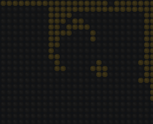 | **Engraving (Blueprint)** Engraving lines rendered in blueprint Prussian blue on white 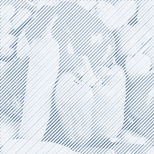 | **Halftone** Simulate print halftone with variable-size dots  |
| **K-means** Cluster pixels into k dominant colors using iterative refinement 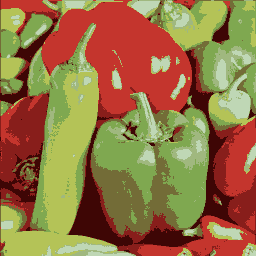 | **Line art** Extract clean black lines from edges, removing all shading 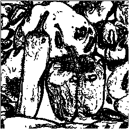 | **Matrix rain** Matrix-style falling character rain using input image luminance  |
| **Mezzotint** Fine random dot texture — density encodes luminance, a specific printmaking technique  | **Mosaic tile** Pixelate with grout lines and per-tile color jitter  | **Oil painting** Quantize colors locally for thick, blobby paint strokes  |
| **Pencil sketch** Directional pencil strokes following edge flow with paper texture 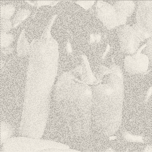 | **Pixel art upscale** Upscale with pixel art algorithms — Scale2x, Eagle, or nearest neighbor  | **Pixel outline** Draw sprite-like borders around sharp color regions for pixel-art styling 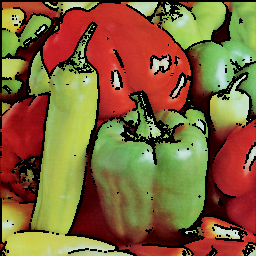 |
| **Pixelate** Downscale into chunky pixel blocks  | **Hex pixelate** Pixelate into staggered hex cells instead of square blocks 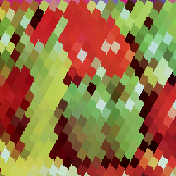 | **Facet / Crystalize Grid** Regularized faceted cells with crisp seams for a crystalized poster look  |
| **Halftone Line** Render short line marks per cell instead of dots for an etched halftone look 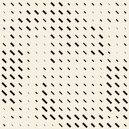 | **Pop art** Ben-Day dots with high saturation and flat posterized colors 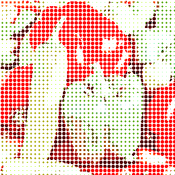 | **Posterize edges** Comic book / cel-shaded look — posterized colors with dark edge outlines 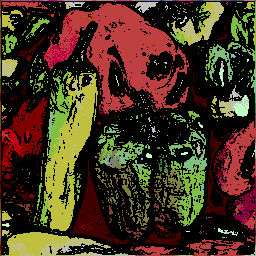 |
| **Risograph** Two-color spot separation with misregistration, grain, and ink bleed  | **Smooth posterize** Posterize with smooth gradient transitions between bands — painted look  | **Stained glass** Voronoi cells with dark leading lines for a stained glass window look  |
| **Stamp** Bold rubber-stamp print with rough edges and uneven ink coverage  | **Stipple** Pointillist dot placement sized by luminance — no grid  | **Stripe (horizontal)** Overlay horizontal stripe pattern over the image  |
| **Stripe (vertical)** Overlay vertical stripe pattern over the image  | **Toon / Cel Shade** Flat cartoon color bands with inked outlines for a cleaner cel-shaded look  | **Triangle pixelate** Pixelate into alternating triangle cells for a faceted low-poly mosaic look  |
| **Voronoi** Divide the image into irregular cell regions with averaged colors  | **Watercolor bleed** Edge-preserving color bleed with paper texture — soft watercolor look  | **Woodcut** High-contrast relief with carved line texture following edge contours  |
| **Woodcut (Ukiyo-e)** Woodcut with Japanese woodblock print colors — sumi ink on cream paper  | **Zigzag** Zigzag herringbone pattern where line thickness encodes luminance  | **Deep fry** Extreme contrast, oversaturation, and JPEG artifacts — the deep-fried meme aesthetic  |
| **Edge glow** Neon-colored edge outlines on a dark background — cyberpunk/Tron aesthetic  | **Film grain** Add film-like noise grain with adjustable size and intensity  | **Chronophotography** Multiple ghosted exposures of moving subjects — stroboscopic photography  |
| **Motion pixelate** Moving areas become pixelated — privacy or artistic motion effect  | **POV Bands** Show different recent moments across horizontal bands like a persistence-of-vision display  | **Stop Motion** Hold each frame for several beats to create a choppy stop-motion cadence  |
| **ABA Bounce** Three-beat A-B-A cadence that snaps the third beat back to the first frame in the triplet  | **ABA Ghost** Three-beat A-B-A cadence with a double-exposed third beat that ghosts the skipped frame against the first  | **Flicker** Aggressive flicker/strobe filter with live ghosting and held-frame flash modes  |
| **Keyframe Smear** Capture sparse keyframes and drag them through in-between frames for compressed temporal smearing  | **Ink Drying** Fresh dark marks stay wet, bleed slightly, and then dry back toward the page  | **Time mosaic** Tiles update at different rates — staggered surveillance-wall aesthetic  |

## Advanced

| | | |
|---|---|---|
| **Kuwahara** Edge-preserving smoothing for a painterly, watercolor-like look  | **Anisotropic diffusion** Smooth flat regions while preserving edges — like Perona-Malik filtering  | **Dilate / Erode** Morphological operations — expand or shrink bright regions  |
| **Infinite call windows** Recursive video-call panes with digital UI chrome and compression-style decay  | **Video feedback** Camera-at-monitor effect — infinite recursive tunnels and fractal patterns  | **Cellular automata** Conway's Game of Life and other rulesets applied to the image — animatable  |
| **Color gradient noise** Perlin noise mapped to a two-color gradient, blended with the input image  | **Displacement map XY** Use separate R/G channels as X/Y displacement maps for organic warping  | **Flow field** Displace pixels along curl noise streamlines for organic swirling patterns  |
| **Frequency Filter** Approximate low, high, or band-pass image frequencies in the spatial domain  | **Fractal** Render Mandelbrot or Julia set fractals, optionally colored from the input image  | **Noise generator** Procedural noise patterns — Perlin, Simplex, or Worley — mixable with the input  |
| **Motion Vectors** Estimate local motion between frames and render stable arrows, trails, or heat overlays for debugging and stylized analysis  | **Program** Write custom pixel-manipulation code in a built-in editor  |  |

## Distort

| | | |
|---|---|---|
| **Chromatic aberration** Offset color channels to simulate lens fringing  | **Chromatic aberration (per-channel)** Move each RGB channel independently for extreme color splitting  | **Displace** Warp pixels using the image's own luminance as a displacement map  |
| **Displace (smooth)** Displacement mapping with a blurred source for gentler warping  | **Flip** Flip the image horizontally, vertically, or both  | **Camera Shake** Handheld whole-frame wobble — translation, rotation, and slight zoom breathing over time  |
| **Rhythmic Wobble** Periodic whole-frame wobble with smooth sinusoidal drift and zoom breathing  | **Lens distortion** Apply barrel distortion like a wide-angle lens  | **Lens distortion (pincushion)** Apply inward pincushion distortion like a telephoto lens  |
| **Lens flare** Camera lens flare with ghost reflections, anamorphic streak, and bloom  | **Liquify** Organic pixel warping driven by luminance gradients  | **Isometric Extrude** Turn the image into stacked isometric slabs with a directional extrusion shadow  |
| **Mirror / Kaleidoscope** Reflect the image along axes or create radial kaleidoscope patterns  | **Mode 7** Project the image onto a receding floor plane like a classic console racer  | **Polar transform** Wrap a rectangle into a circle or unwrap a circular image into a strip  |
| **Pinch** Squeeze pixels toward or away from center — radial scale distortion  | **Ripple** Concentric circular waves radiating from center  | **Rotate** Arbitrary angle rotation with bilinear sampling  |
| **Smudge** Paint-like smudging — drags color along a direction  | **Spherize** Wrap image onto a sphere surface with adjustable strength  | **Stretch** Non-uniform X/Y scaling from center  |
| **Swirl** Twist the image with rotation that increases toward the center  | **Time-warp Displacement** Use luminance or position to sample different recent moments per pixel  | **Turbulence** Perlin noise-driven displacement for organic warping  |
| **Wave** Displace pixels along sine waves for a ripple effect  | **Slit scan** Each column shows a different point in time — surreal temporal stretching  | **ABA Rebound** On the third beat, push motion away from the first frame in the triplet for a recoiling ABA judder  |
| **Wake turbulence** Moving objects leave rippling distortion — heat shimmer effect  |  |  |

## Glitch

| | | |
|---|---|---|
| **Analog static** Analog TV static — noise bars, vertical hold drift, and ghosting  | **Bit crush** Reduce bit depth per channel for harsh color banding  | **Bitplane Dropout** Corrupt specific RGB bitplanes in bursts so significance levels drop, freeze, or flip like real digital faults  |
| **CRC Stripe Reject** Reject stripes or tiles like failed CRC packets, then conceal with hold, row-copy, or nearest-valid fill  | **Channel separation** Split and offset RGB channels for a glitchy color-fringe look  | **Data bend** Treat pixel data as audio — apply echo, reverb, bitcrush, or reverse  |
| **Datamosh** Simulate I-frame removal — blocks persist, smear, and corrupt like broken video compression  | **Glitch** Randomly corrupt pixel data to simulate digital artifacts  | **Glitch blocks** Rectangular block displacement — simulates GPU memory corruption  |
| **Interlace tear** Even/odd row offset simulating torn interlaced video  | **Jitter** Randomly shift pixel rows for a shaky, unstable signal look  | **JPEG artifact** Apply DCT block compression artifacts at controllable quality and block size  |
| **Palette Index Drift** Map into an indexed palette, then drift the lookup table over time so colors break while geometry stays stable  | **Pixel drift** Pixels fall or rise based on luminance — melting/gravity effect  | **Pixel scatter** Explode pixels outward from edges — disintegration effect  |
| **Pixelsort** Sort pixel spans by brightness for dramatic streak effects  | **Scan line shift** Offset horizontal scan line blocks for a broken display glitch effect  | **Scanline Warp** Sinusoidal horizontal displacement with animatable phase — wavy CRT glitch  |
| **Freeze frame glitch** Random blocks freeze in time — corrupted buffer aesthetic  |  |  |

## Simulate

| | | |
|---|---|---|
| **Anaglyph 3D** Split channels into stereoscopic color pairs for a fake 3D glasses effect  | **CRT emulation** Simulate a CRT monitor with phosphor mask, bloom, scanlines, curvature, and vignette  | **CRT Degauss** Fire a decaying degauss pulse with raster wobble, phosphor mislanding, and a bright magnetic flash  |
| **Daguerreotype** Early photography — silver-blue tone, soft focus, oval vignette, metallic sheen  | **Digicam Flash** On-camera point-and-shoot flash look with center hotspot, fast falloff, clipped highlights, and edge burn  | **E-ink (color)** Simulate a color Kaleido/Gallery e-ink display with washed-out palette  |
| **E-ink (grayscale)** Simulate a 16-level grayscale e-ink display with paper texture and ghosting  | **Fax machine** Low-res binary with scan line artifacts, thermal paper yellowing, and compression noise  | **Film burn** Aged film stock — warm edge cast, overexposed hotspots, grain intensification  |
| **Ink Bleed** Spread dark regions into the paper like wet ink on cheap stock  | **Gameboy Camera** Simulate the Gameboy Camera — 4-shade green palette with edge enhancement and ordered dithering  | **Infrared photography** IR film look — foliage turns white/pink, skies go dark, color shift  |
| **LCD display** Visible sub-pixel grid — RGB stripe, PenTile, or diamond layout  | **Lenticular** Holographic rainbow sheen strips that shift with a simulated angle  | **Light leak** Film light leak — warm chromatic glow bleeding from edges/corners  |
| **Mavica FD7** Emulate the Sony Mavica FD7 — low-res JPEG on a floppy disk  | **Metadata Mismatch Decode** Apply wrong gamma, matrix, range, and chroma assumptions to mimic authentic decode metadata failures  | **Newspaper** Coarse halftone on yellowed paper with fold creases and ink smear  |
| **Night vision** Gen 3 image intensifier tube — green phosphor, heavy grain, bloom, and circular vignette  | **Nokia LCD** Simulate the Nokia 3310 monochrome LCD — 84x48 pixels with greenish tint  | **Oscilloscope** Render as phosphor traces on a dark CRT oscilloscope screen with bloom and persistence  |
| **Photocopier** High contrast, edge darkening, speckle, and generation loss  | **Polaroid** Instant film look — warm tones, faded blacks, soft highlights, and film grain  | **Projection film** 16mm/35mm projector — gate weave, dust, scratches, grain, and lamp flicker  |
| **Risograph (multi-layer)** 3-4 color spot separation with per-layer misregistration and grain  | **Screen Print / Misregistration** Layer flat spot-color plates with visible offset on warm paper for a silkscreen poster look  | **Scanline** CRT-style scanlines with either classic darkened rows or RGB phosphor sub-line separation  |
| **Spectrogram** Frequency-domain visualization — columns as time, rows as frequency, with scientific colormaps  | **Teletext** Simulate a Teletext/Ceefax block mosaic display with 2x3 character cells and 8 colors  | **Thermal camera** FLIR-style false-color thermal imaging with ironbow, rainbow, and hot/cold palettes  |
| **Thermal printer** Receipt printer — low-res dots, paper curl gradient, thermal ink fade  | **Ultrasound** Medical ultrasound display — fan-shaped sector scan with speckle noise  | **VHS emulation** Simulate VHS tape — tracking errors, chroma delay, head-switching noise, and ghosting  |
| **Vintage TV** Old TV with banding, color fringe, vertical roll, and glow — animatable  | **Motion Analysis** Analyze motion against the background model or previous frame and render it as a mask, highlight, or persistent heatmap  | **Long Exposure** Blend, average, or accumulate recent frames for ghost trails, slow-shutter smear, and long-exposure light painting  |
| **Phosphor decay** CRT phosphor persistence — each RGB channel decays at a different rate  | **After-image** Complementary-colored ghost when bright objects move — retinal fatigue  | **Time Median** Per-pixel median across recent frames to suppress brief motion and flicker while preserving stable structure  |

## Blur & Edges

| | | |
|---|---|---|
| **Bilateral blur** Edge-preserving smooth — blurs flat areas while keeping edges crisp  | **Bloom** Add a soft glow around bright areas  | **Bokeh** Simulate out-of-focus highlights with hexagonal or circular bokeh shapes  |
| **Convolve** Apply a custom convolution kernel — blur, sharpen, emboss, and more  | **Convolve (edge detection)** Detect edges using a Laplacian convolution kernel  | **Despeckle** Adaptive noise removal — smooths noisy areas while preserving structured detail  |
| **Emboss** Directional relief effect with adjustable light angle and blend  | **Gaussian blur** Smooth the image with a Gaussian kernel — adjustable sigma  | **Median filter** Non-linear noise removal — replaces each pixel with the median of its neighborhood  |
| **Motion blur** Directional blur simulating camera or object motion  | **Relief Map / Faux Normal Lighting** Treat luminance like a height field and relight it with directional faux-surface shading  | **Radial blur** Zoom blur radiating from center — speed/motion effect  |
| **Sharpen** Unsharp mask — enhance edges with adjustable strength and radius  | **Tilt shift** Miniature/toy camera effect — sharp focus band with progressive blur  | **Temporal Edge** Detect edges in time — moving edges glow, static edges invisible  |
| **Motion Relief** Turn recent change history into embossed grayscale relief shading  |  |  |

## Presets

## Dithering

| | | |
|---|---|---|
| **Amber Terminal** Monochrome amber phosphor dithering with CRT glow  | **Gameboy Screen** 4-shade green LCD with visible scan lines and edge darkening  | **Median Palette** Adaptive median-cut palette reduction for a compact posterized color set  |
| **Octree Palette** Adaptive octree palette reduction with a slightly harsher retro posterization bias  | **PICO-8 Demake** Chunky pixels quantized to the PICO-8 16-color palette  | **Vaporwave Dither** Pastel error-diffused dithering with dreamy bloom and color fringe  |

## Color

| | | |
|---|---|---|
| **Acid Trip** Temporal color cycling through solarized bloom  | **Cutout** Luminance-based matte cutout with clean graphic separation  | **Duotone Poster** Two-tone flat poster with bold tonal contrast  |
| **Empty Room** Static structures remain while moving people gradually disappear  | **Gradient Remap** Map luminance to a custom color gradient with soft glow  | **HDR Tone Map** Aggressive local contrast with dodged highlights and burned shadows  |
| **Hue Bands** Map broad hue families into a deliberate palette while keeping image structure intact  | **Infrared Film** False-color IR — white foliage, dark skies, pink cast  | **Photo Pro** Gentle tonal shaping and sharpening for a polished photographic finish  |
| **Psychedelic** Motion-reactive rainbow cycling with bloom and color split  | **Red Coat** Keep one accent hue vivid while the rest falls back toward monochrome  | **Resonator** Motion-reactive color echo with a glowing amplified difference image  |
| **Shop Photo** Commercial-style tone cleanup with local contrast and vignette  | **Solarized** Sabattier effect — partial tone reversal with boosted contrast  | **Virtual Greenscreen** Remove static background, keep only moving foreground  |
| **Zine Cover** Two-ink offset print on warm paper stock with a poster-like finish  |  |  |

## Anime & Paint-over

| | | |
|---|---|---|
| **Anime Background** Paint-over starter for streets and landscapes with broader tone bands, anime grading, and atmospheric depth  | **Anime Clean** Edge-preserved smoothing, cel-style banding, and anime-background color grading for a clean painted base  | **Anime Ink Grade** Clean anime grading pass with bilateral smoothing, sharpened detail, and restrained overlaid ink lines  |
| **Graphic Anime Palette** Sharper ink-and-palette anime treatment with flatter color families and overlaid traced edges that sit on top of the base image  | **Shinkai Sky Base** Sky-first anime background base with painted clouds, broader light bands, cool shadows, warm highlights, and restrained glow  | **Soft Anime Paint** Foliage and texture simplification for a softer hand-painted anime background feel with a light finishing ink pass  |

## Blur & Edges

| | | |
|---|---|---|
| **Dream Sequence** Soft vaseline-lens glow with warm light bleed — flashback cinema  | **Embossed Metal** Raised relief surface — metallic highlight and shadow from edges  | **Ghost** Temporal echo with soft glow — moving subjects leave ghostly trails  |
| **Miniature World** Fake tilt-shift diorama — selective focus makes scenes look tiny  | **Motion Neon** Neon-traced motion outlines with chromatic splitting  |  |

## Advanced

| | | |
|---|---|---|
| **Band Pass** Middle image frequencies isolated into a technical texture-study view  | **Cellular Life** Conway's Game of Life with neon-glowing cell boundaries  | **Flow Painting** Curl noise streamlines blended with thick painterly strokes  |
| **Fractal Overlay** Mandelbrot fractal with source image colors and edge glow  | **Infinite Tunnel** Zooming recursive video feedback with optional rainbow-vortex energy and fractal bloom  | **Meeting Meltdown** Recursive video-call panes with digital UI drift and compression wear  |
| **Motion Compass** Animated motion arrows reveal direction changes like a technical field overlay  | **Stargate** Temporal slit scan with chromatic aberration and glow  | **Traffic Trails** Motion vectors plus glow for a kinetic traffic-map feel on live footage  |

## Distort

| | | |
|---|---|---|
| **Earthquake** Violent displacement — Perlin warping, sine waves, and shaky rows  | **F-Zero Floor** Console-racer ground plane rushing toward the horizon  | **Funhouse Mirror** Carnival mirror — bulging center with barrel edges and asymmetric stretch  |
| **Heat Shimmer** Motion-reactive heat distortion with glow  | **Hex World** Staggered hex cells with soft glow — honeycomb posterization  | **Iso Stack** Poster-like isometric slab extrusion with bold depth and arcade shading  |
| **Kaleidoscope** Radial symmetry with prismatic color splitting and soft glow  | **Melt** Organic pixel melting — warped, smeared, and dripping by luminance  | **Time Mirror** Different parts of the image pull from different moments in recent history  |
| **Time Slice** Temporal slit scan — each column is a different moment  | **Tunnel Wrap** Wrap the image into a circular tunnel and add a subtle glow  |  |

## Glitch

| | | |
|---|---|---|
| **Bit Rot** Severe digital decay — crushed bits, channel corruption, scattered pixels, heavy compression  | **Broadcast Failure** Corrupted broadcast — smeared I-frames, split channels, shifted lines  | **Checksum Storm** Rejected packet stripes with unstable concealment and downstream decode wear  |
| **Color Freeze** Freeze-frame glitch with optional RGB channel splitting, from subtle holds to hard color-split corruption  | **Data Corruption** Broken compression — smeared blocks and DCT artifacts  | **Glitch Art** Sorted pixel streaks, split channels, shifted scan lines  |
| **Legacy LUT Collapse** Indexed palette table drifts while bitplane bursts erode color significance  | **Panorama Glitch** Temporal slit scan with JPEG corruption  | **VHS Pause** Frozen VHS frame — tracking errors, torn fields, and static snow  |

## Stylize

| | | |
|---|---|---|
| **ASCII Art** Render the image as a grid of ASCII characters sized by luminance  | **Cel Panel** Flat cartoon shading with crisp ink contours  | **Censored** Moving areas become pixelated blocks  |
| **Crystal Poster** Broad crystalized planes with dark seams and a polished poster finish  | **Embroidery Hoop** Threaded X-stitches on warm fabric with a handmade feel  | **Currency Engraving** Fine parallel lines on aged paper — banknote illustration style  |
| **Dot Matrix Printer** Fixed-pitch impact dots on warm aged paper  | **Etching** Short ink marks build tone like a coarse engraved print  | **Ghost Dance** Chronophotography ghosts with bloom, balancing Marey-style strobing and dreamy color-fringed echoes  |
| **Living Photo** Freeze the still parts of the scene while motion stays alive  | **Lo-fi Print** Warm-toned halftone print with film grain texture  | **Mosaic** Irregular tile grid with grout lines — ancient mosaic look  |
| **Neon** Glowing edge outlines on dark background with color fringe  | **Neon Afterglow** Neon edges with complementary-colored ghosts  | **Night City** Posterized neon signage and glowing street-edge contours without the CRT simulation layer  |
| **Pixel Art** Chunky pixels quantized to limited colors then upscaled crisp  | **POV Display** Horizontal bands each show a slightly different recent moment  | **Pop Art** Warhol-style Ben-Day dots with flat posterized colors and glow  |
| **Protest Poster** Bold stamped silhouette on warm paper with rough edges  | **Risograph** Multi-layer spot color separation with misregistration and grain  | **Sketch** Pencil strokes following edge flow with soft vignette  |
| **Sprite Sheet** Game-like chunky color blocks with bold sprite borders  | **Stained Glass** Voronoi cells with dark leading and glowing colored glass  | **Stop-Mo Comic** Choppy held frames with flatter comic-style tones  |
| **Triangle World** Faceted triangular cells with crisp low-poly structure  | **Watercolor** Soft wet-on-wet painting with outlined edges  | **Woodblock Print** Japanese woodblock style — sumi ink carved lines on cream  |

## Simulate

| | | |
|---|---|---|
| **Blueprint** Architectural line drawing — white lines on blue  | **Cyberpunk** Neon-soaked CRT with chromatic split and bloom glow  | **Degauss Ritual** Tube wobble, phosphor mask, and lingering afterglow; trigger the degauss pulse for the full effect  |
| **Daguerreotype** 1839 silver-plate photography with soft vignette and grain  | **Fax Machine** Thermal fax output — binary with scan artifacts and speckle  | **Film Projector** Flickering 8mm home movie with gate weave and sprocket burns  |
| **Frame Diff** Technical frame-to-frame motion highlight on a dark background  | **Heat Vision** Motion detection with bloom glow — thermal camera aesthetic  | **Ink Spread** Cheap paper stock with dark regions bleeding into the fibers  |
| **Lenticular Card** Holographic rainbow sheen with scanlines and glow  | **Lo-fi Webcam** Chunky pixels with JPEG artifacts and film grain  | **Metadata Mistake** Wrong decode assumptions with compression wear and hard edge recovery  |
| **Mavica Photo** Sony Mavica floppy disk camera — 640x480, heavy JPEG, CCD noise  | **Matrix** Digital rain — source image visible through falling katakana characters  | **Misprint** Silkscreen poster layers drift slightly out of register over warm paper  |
| **Newsprint** Black-and-white newspaper with coarse halftone dots  | **Photocopier** High-contrast office copier with speckle and generation loss  | **Privacy Mode** Moving areas heavily pixelated and blurred  |
| **Receipt Printer** Narrow thermal receipt — low-res dots with ink fade  | **Retinal Burn** Bright objects leave complementary-colored after-images  | **Retro 3D** Classic red/cyan glasses effect with posterized comic contrast  |
| **Retro TV** Consumer tape playback through a CRT tube with tracking wear and rounded-screen falloff  | **Security Camera** Monochrome security feed with an explicit motion-analysis overlay for moving subjects  | **Shutter Smear** Slow-shutter averaging with soft tonal drag across motion  |
| **Surveillance DVR Failure** Near-failure CCTV feed with CRC stripe loss, bitplane bursts, and codec breakup  | **Surveillance** Night-vision CCTV look with scanlines, compression, and no analysis overlay  | **Surveillance Wall** Tiles updating at staggered rates with scanlines and grain  |
| **Thermal** FLIR-style heat map with posterized temperature bands  | **Underwater** Motion-reactive ripple distortion with chromatic split  | **Vinyl Record** Press the image into tight groove-like bands, wrap it into a circular disc, and darken the edge like a black vinyl record  |

## Photo

| | | |
|---|---|---|
| **Double Exposure** Classic film double exposure with bloom and tonal control  | **Noir** High-contrast black and white with grain and vignette  | **Polaroid** Instant film look with faded edges and subtle grain  |
| **Vintage Photo** Warm sepia toning with chemical grain and light bleed  |  |  |

